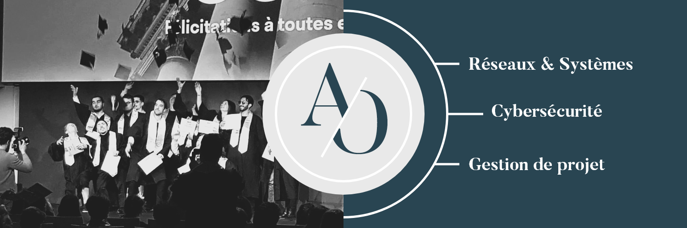

<!--
**aymericoliveira/aymericoliveira** is a ✨ _special_ ✨ repository because its `README.md` (this file) appears on your GitHub profile.

Here are some ideas to get you started:

- 🔭 I’m currently working on ...
- 🌱 I’m currently learning ...
- 👯 I’m looking to collaborate on ...
- 🤔 I’m looking for help with ...
- 💬 Ask me about ...
- 📫 How to reach me: ...
- 😄 Pronouns: ...
- ⚡ Fun fact: ...
-->

## Salut, moi c'est Aymeric 👋

🎯 **Profil polyvalent** entre **infrastructure**, **cybersécurité**, et **web**.  
🚀 Actuellement en formation pour devenir **Expert IT Réseaux & Systèmes**.  
🛠️ Passionné par la création de labos virtuels (vSphere, Proxmox) et la découverte de nouvelles technos.  
📚 Toujours en train d'apprendre et de construire de nouveaux projets.

## 🚀 Ce que je fais en ce moment
- Création d'un lab afin d’automatiser le déploiement des VMs avec **Vagrant** pour la gestion des VMs et **Ansible** pour leur configuration.
- Création d'un **Home Lab complet** pour m'entraîner aux environnements serveurs et réseaux
- Étude pour la certification **CCNA** et d'autres certifications IT à venir
- **MOOC de l'ANSSI** > https://secnumacademie.gouv.fr/

## 📈 Mes projets récents
- **HOME_LAB_vSphere** - Installation d'un cluster VMware pour laboratoires personnels [https://github.com/aymericoliveira/HOME_LAB_vSphere]
- **Hackaton** - Mise en place de la haute disponibilité des firewalls et de sécuriser l’infrastructure réseau. [https://github.com/aymericoliveira/Hackaton_TAN_Consulting]
- **Formation continue** sur Git, Docker, cybersécurité, et infrastructures réseaux

## 🎯 Prochaines compétences visées
Dans les semaines à venir, je vais approfondir mes connaissances sur :

- **Kubernetes** : orchestration de conteneurs 
- **Docker** : perfectionnement en containerisation
- **Jenkins** : automatisation des déploiements (CI/CD)
- **Terraform**: déploiement d’infrastructures Cloud as Code
- **Azure** : gestion et sécurisation des ressources Cloud

## 📫 Me contacter
> - LinkedIn : [www.linkedin.com/in/aymericoliveira]

> - GitHub : [aymericoliveira](https://github.com/aymericoliveira)  

⭐ N'hésite pas à suivre mes projets ou à venir discuter ! ⭐

